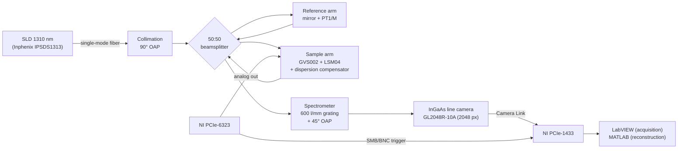

# SD-OCT 1310 nm

🔬 Signal processing, GUI and technical assembly documentation for the
1310 nm spectral-domain optical coherence tomography (SD-OCT) system developed
by the **Biophotonics and Biomedical Optics Research Group (GIBIO)** at the
Pontificia Universidad Católica del Perú (PUCP).

The system is a laboratory prototype built from free-space optics on optical
breadboards: a fiber-coupled SLD source, a Twyman–Green interferometer, a
sample arm with a two-axis galvanometer and a telecentric scan lens, and a
custom spectrometer with a reflective diffraction grating and an InGaAs
line-scan camera. Acquisition and hardware control run in LabVIEW;
reconstruction runs in MATLAB.

> **Status:** the system is functional and characterized. Code and
> documentation are being added to this repository progressively; see the
> [Roadmap](#roadmap).

---

## Contents

- [System performance](#system-performance)
- [Architecture](#architecture)
- [Main components](#main-components)
- [Acquisition parameters](#acquisition-parameters)
- [Processing pipeline](#processing-pipeline)
- [Repository structure](#repository-structure)
- [Software requirements](#software-requirements)
- [Quick start](#quick-start)
- [Data](#data)
- [Application: motion-based OCT](#application-motion-based-oct)
- [Roadmap](#roadmap)
- [How to cite](#how-to-cite)
- [Authors and funding](#authors-and-funding)

---

## System performance

Values measured in air, in the final alignment of the system. The
up-to-date reference values are kept in
[`characterization/LATEST.md`](characterization/LATEST.md), and the methods
are described in
[`docs/04_characterization_methods.md`](docs/04_characterization_methods.md).

| Parameter | Expected | Measured | Method |
|---|---|---|---|
| Central wavelength | 1310 nm (nominal) | **1317.97 nm** | Source certificate |
| Bandwidth (FWHM) | — | **90.29 nm** | Source certificate |
| Source optical power | — | **10.14 mW** | Source certificate |
| Axial resolution | 8.49 µm (theoretical) | **9.65 µm** | PSF FWHM of a mirror near zero delay |
| Lateral resolution | — | **11.04 µm** | USAF 1951 target, group 5, element 4 |
| Axial sampling | — | 1.483 µm/px (8192-pt FFT) · 2.966 µm/px (4096-pt FFT) | Axial calibration, mirror on micrometer stage |
| Reconstructed axial range | — | 6.07 mm (Nyquist) | 1024 × 5.931 µm |
| Imaging depth (−10 dB) | 3.57 mm (model) | **3.45 mm** (≈ 2.6 mm in water) | Signal roll-off |
| Sensitivity | — | **79.6 dB** | Mirror + ND filter (OD 1.02 at 1310 nm, double pass) |
| Signal roll-off | — | −3.32 dB/mm | Linear fit, 0.08–4.08 mm |
| Phase stability | — | **0.636 mrad** | Common path (coverslip), 1000 A-lines |
| Displacement sensitivity | — | 66.7 pm (air) | σφ·λ₀ / 4π |
| Galvanometer factor, X | 0.424 V/mm | **0.4053 V/mm** | Three-dot target, 7 fields of view |
| Galvanometer factor, Y | 0.424 V/mm | **0.4071 V/mm** | Three-dot target, 7 fields of view |
| Line rate | ≤ 147 kHz (camera) | 50 kHz (operating) | Hardware trigger |

---

## Architecture



The system is organized into three modular subsystems, each aligned and
characterized independently:

1. **Spectrometer**: fiber point source → 90° off-axis parabolic mirror
   (≈ 2 cm collimated beam) → reflective grating in the first order → 45°
   off-axis parabolic mirror → line-scan camera tilted ≈ 20–25°, placed
   ≈ 20.32 cm from the focusing mirror.
2. **Twyman–Green interferometer**: the collimated beam is split into a
   reference arm (mirror on a translation stage to set the zero delay) and a
   sample arm.
3. **Scanning and acquisition**: two-axis galvanometer and LSM04 scan lens
   (f = 54 mm), synchronized with the camera through hardware clocks
   (100 MHz base clock, 10 ns resolution).

The optical axis height is fixed at **≈ 10.5 cm** above the breadboard for
all components. The mechanical layout was first validated with a virtual
assembly in Autodesk Fusion 360 built from the manufacturer's STEP models
([`hardware/cad/`](hardware/cad/)).

More detail in [`docs/01_system_architecture.md`](docs/01_system_architecture.md).

---

## Main components

| Subsystem | Component | Model |
|---|---|---|
| Source | Superluminescent diode (SLD) | Inphenix IPSDS1313-0321 |
| Source | Fiber adapter (point source) | Thorlabs SM1FC |
| Spectrometer | Reflective diffraction grating, 600 l/mm | Thorlabs GR50A-0610 |
| Spectrometer | Off-axis parabolic mirrors | 90° (collimation) and 45° (focusing) |
| Spectrometer | InGaAs line-scan camera, 2048 px, 10 µm pitch, 147 kHz | Sensors Unlimited GL2048R-10A |
| Interferometer | 50:50 cube beamsplitter | Thorlabs CCM1-BS015/M |
| Interferometer | Reference mirror translation stage | Thorlabs PT1/M |
| Sample arm | Two-axis galvanometer | Thorlabs GVS002 (GCM102/M mount) |
| Sample arm | OCT scan lens, f = 54 mm | Thorlabs LSM04 |
| Sample arm | Dispersion compensator | Matched to the LSM04 |
| Electronics | Camera Link frame grabber | National Instruments PCIe-1433 |
| Electronics | DAQ and waveform generation | National Instruments PCIe-6323 |

The full bill of materials is in [`hardware/BOM.md`](hardware/BOM.md).

---

## Acquisition parameters

| Parameter | Symbol | Value |
|---|---|---|
| Operating line rate | 1/T_A | 50 kHz (T_A = 20 µs) |
| Samples per A-line | — | 2048 spectral pixels, 16 bit |
| A-lines per B-scan | N_A | 250, 500 (nominal) or 1000 |
| Samples discarded at turnaround | N_w | 15 |
| B-scan period | T_B = (N_A + N_w)·T_A | 5.30 / 10.30 / 20.30 ms |
| B-scan rate | f_B | 188.7 / 97.1 / 49.3 Hz |
| Fast-axis waveform | — | triangular, bidirectional (one B-scan per ramp) |
| Field of view | L_x = V_pp / κ_x | up to 14.1 × 14.1 mm (LSM04 diffraction-limited field) |
| Data rate | — | ≈ 205 MB/s (≈ 10.2 GB per 5000 B-scans with N_A = 500) |

Peak-to-peak drive voltage for typical fields of view (V_pp = κ·L):

| Field (mm) | V_pp,x (V) | V_pp,y (V) |
|---|---|---|
| 3.0 | 1.22 | 1.22 |
| 6.0 | 2.43 | 2.44 |
| 10.0 | 4.05 | 4.07 |
| 14.1 | 5.71 | 5.74 |

See [`docs/05_operation_and_acquisition.md`](docs/05_operation_and_acquisition.md).

---

## Processing pipeline

Each A-line of 2048 spectral samples is processed as follows:

1. **DC subtraction**: remove the non-interferometric component (background
   spectrum).
2. **Wavenumber linearization**: spline resampling from λ to a uniform
   k grid. Spectrometer calibration: λ varies linearly from
   **1262.34 nm (pixel 1)** to **1471.08 nm (pixel 2048)**.
3. **Hann window**.
4. **Zero-padded FFT**: 8192 points (characterization) or 4096 points
   (imaging). Only the non-conjugate half is kept.
5. **Log scale**: 20·log₁₀|FFT|.
6. **B-scan assembly**: A-lines acquired on the backward ramp are flipped so
   that every B-scan has the same fast-axis orientation.

Dispersion is compensated **optically** in the sample arm, so no numerical
phase coefficients are applied. Depth conversion: z = p / 0.6744 µm, with p
the pixel index of the 8192-point reconstruction.

See [`processing/matlab/README.md`](processing/matlab/README.md).

---

## Repository structure

```
SD-OCT-1310-nm/
├── README.md
├── CITATION.cff                  Citation metadata
├── docs/                         Technical documentation (procedures)
│   ├── 01_system_architecture.md
│   ├── 02_assembly_guide.md      Step-by-step assembly and alignment
│   ├── 03_calibration.md         Axial, spectral and lateral calibration
│   ├── 04_characterization_methods.md
│   ├── 05_operation_and_acquisition.md
│   └── img/                      Documentation figures
├── characterization/             Characterization results, kept up to date
│   ├── LATEST.md                 Current reference values of the system
│   ├── HISTORY.md                Log of all characterization campaigns
│   ├── _template/                Template for a new campaign
│   └── YYYY-MM_<description>/    One folder per campaign (data + figures)
├── hardware/                     Physical documentation of the system
│   ├── BOM.md                    Bill of materials
│   ├── cad/
│   │   ├── fusion360/            Virtual assembly (.f3d)
│   │   └── step/                 STEP models of the subsystems
│   ├── 3d_printing/              Printed parts (mounts, connectors)
│   └── wiring/                   Connections and synchronization signals
├── acquisition/                  Acquisition and hardware control
│   ├── labview/                  Acquisition and galvanometer-control VIs
│   └── camera_config/            Camera Link configuration of the camera
├── processing/
│   └── matlab/                   Reconstruction and analysis
│       ├── config/               System and calibration parameters
│       ├── io/                   TDMS file readers
│       ├── reconstruction/       DC, k-linearization, window, FFT
│       ├── imaging/              B-scans, volumes and en face projections
│       ├── calibration/          Axial and galvanometer calibration
│       ├── characterization/     PSF, sensitivity, roll-off, phase analysis
│       └── utils/                Helper functions
├── gui/                          User interfaces
│   ├── characterization/         Characterization tool (8192-pt FFT)
│   └── imaging/                  Imaging tool (4096-pt FFT)
└── data/                         Lightweight calibration and sample data
    ├── calibration/
    └── samples/
```

Each top-level folder has its own `README.md` describing what it contains.
`docs/` describes **how** each measurement is made; `characterization/`
records **what** was measured and when.

---

## Software requirements

| Component | Purpose |
|---|---|
| LabVIEW + NI-DAQmx | PCIe-6323 control (galvanometers and triggers) |
| NI Vision Acquisition Software (NI-IMAQ) | PCIe-1433 frame grabber and Camera Link camera |
| MATLAB | Reconstruction, calibration and characterization |
| Autodesk Fusion 360 | Virtual assembly (optional) |

> Exact versions will be documented together with the corresponding code.

---

## Quick start

1. **Assembly and alignment**: follow
   [`docs/02_assembly_guide.md`](docs/02_assembly_guide.md).
2. **Calibration**: obtain the pixel-to-depth relation and the galvanometer
   V/mm factors ([`docs/03_calibration.md`](docs/03_calibration.md)) and
   update the values in `processing/matlab/config/`.
3. **Characterization**: measure resolution, sensitivity and roll-off, and
   record the results as a new campaign in
   [`characterization/`](characterization/).
4. **Acquisition**: set the line rate, N_A and field of view in the LabVIEW
   interface and acquire the data as TDMS files.
5. **Reconstruction**: process the TDMS files with the scripts in
   `processing/matlab/` to obtain B-scans, volumes and en face projections.

---

## Data

- This repository holds **lightweight data only**: calibration tables,
  characterization summaries and small sample datasets.
- Raw OCT data (`.tdms` files, several GB per session) are **not
  versioned** (see `.gitignore`). They are kept on institutional storage and
  may be published in an external data repository (e.g. Zenodo or OSF).

See [`data/README.md`](data/README.md).

---

## Application: motion-based OCT

This system is the optical core of the MSc thesis *"Development of an
Optical Coherence Tomography Imaging Method for Nile Tilapia Fry Under
Controlled Translational Motion"* (PUCP). In that application the slow axis
of the volume is produced by the displacement of the specimen rather than by
the galvanometer: sedated Nile tilapia (*Oreochromis niloticus*) fry are
carried through a glass chamber under the scan lens, an external camera
measures their trajectory, and each B-scan is placed at the coordinate
measured at its acquisition instant.

The maximum admissible specimen velocity for a longitudinal sampling
R (mm/px) is

```
V_max = R / ((N_A + N_w) · T_A) = R · f_B
```

With R = 20 µm this gives V_max = 3.77, 1.94 and 0.99 mm/s for N_A = 250,
500 and 1000.

The tracking and volumetric reconstruction code for that application will be
released after the thesis defense.

---

## Roadmap

- [x] Repository structure and general documentation
- [x] Characterization log with the current reference values
- [ ] LabVIEW acquisition and synchronization VIs
- [ ] MATLAB reconstruction scripts (A-line → B-scan → volume)
- [ ] Calibration (axial and galvanometer) and characterization scripts
- [ ] Characterization and imaging GUIs
- [ ] CAD assembly and 3D-printed parts
- [ ] Photographs of the assembled system and wiring diagrams
- [ ] Sample dataset
- [ ] License

---

## How to cite

If you use this system or its code, please cite the associated thesis (see
[`CITATION.cff`](CITATION.cff)):

> Barreto Espinosa, L. E. (2026). *Development of an Optical Coherence
> Tomography Imaging Method for Nile Tilapia Fry Under Controlled
> Translational Motion* [Master's thesis, Pontificia Universidad Católica
> del Perú].

---

## Authors and funding

- **Author:** Luis Eduardo Barreto Espinosa — luis.barretoe@pucp.edu.pe
- **Advisor:** José Fernando Zvietcovich Zegarra
- **Group:** Biophotonics and Biomedical Optics Research Group (GIBIO), PUCP
- **Funding:** CONCYTEC-PROCIENCIA (PI 1242 – PE501093888)

## License

No license has been chosen yet. Until a `LICENSE` file is added, all rights
are reserved.
