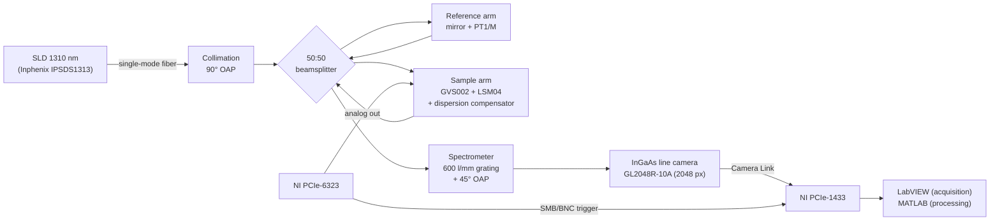

# SD-OCT 1310 nm

🔬 Signal processing, GUI and technical assembly documentation for the
1310 nm spectral-domain optical coherence tomography (SD-OCT) system developed
by the **Biophotonics and Biomedical Optics Research Group (GIBIO)** at the
Pontificia Universidad Católica del Perú (PUCP).

The system is a laboratory prototype built from free-space optics on optical
breadboards: a fiber-coupled SLD source, a Twyman–Green interferometer, a
sample arm with a two-axis galvanometer and a telecentric scan lens, and a
custom spectrometer with a reflective diffraction grating and an InGaAs
line-scan camera. Acquisition and hardware control run in LabVIEW.

The maintained **MATLAB OCT/OCE processing workflow** (reconstruction, phase
estimation, filtering, Lamb-wave phase-speed analysis and experimental
summaries) lives in [`OCE_workflow/`](OCE_workflow/) and supports this system
through the `spectral_domain_1310` profile.

---

## Contents

- [System performance](#system-performance)
- [Architecture](#architecture)
- [Main components](#main-components)
- [Acquisition parameters](#acquisition-parameters)
- [Processing](#processing)
- [Repository structure](#repository-structure)
- [Software requirements](#software-requirements)
- [Data](#data)
- [Application: motion-based OCT](#application-motion-based-oct)
- [Roadmap](#roadmap)
- [How to cite](#how-to-cite)
- [Authors and funding](#authors-and-funding)
- [License](#license)

---

## System performance

Values measured in air, in the final alignment of the system. The
up-to-date reference values are kept in
[`characterization/LATEST.md`](characterization/LATEST.md), and the methods
are described in
[`docs/04_characterization_methods.md`](docs/04_characterization_methods.md).

| Parameter | Expected | Measured | Method |
|---|---|---|---|
| Central wavelength | 1310 nm (nominal) | **1317.97 nm** | Source certificate |
| Bandwidth (FWHM) | — | **90.29 nm** | Source certificate |
| Source optical power | — | **10.14 mW** | Source certificate |
| Axial resolution | 8.49 µm (theoretical) | **9.65 µm** | PSF FWHM of a mirror near zero delay |
| Lateral resolution | — | **11.04 µm** | USAF 1951 target, group 5, element 4 |
| Axial sampling | — | 1.483 µm/px (8192-pt FFT) · 5.931 µm per native sample | Axial calibration, mirror on micrometer stage |
| Reconstructed axial range | — | 6.07 mm (Nyquist) | 1024 × 5.931 µm |
| Imaging depth (−10 dB) | 3.57 mm (model) | **3.45 mm** (≈ 2.6 mm in water) | Signal roll-off |
| Sensitivity | — | **79.6 dB** | Mirror + ND filter (OD 1.02 at 1310 nm, double pass) |
| Signal roll-off | — | −3.32 dB/mm | Linear fit, 0.08–4.08 mm |
| Phase stability | — | **0.636 mrad** | Common path (coverslip), 1000 A-lines |
| Displacement sensitivity | — | 66.7 pm (air) | σφ·λ₀ / 4π |
| Galvanometer factor, X | 0.424 V/mm | **0.4053 V/mm** | Three-dot target, 7 fields of view |
| Galvanometer factor, Y | 0.424 V/mm | **0.4071 V/mm** | Three-dot target, 7 fields of view |
| Line rate | ≤ 147 kHz (camera) | 50 kHz (operating) | Hardware trigger |

---

## Architecture



The system is organized into three modular subsystems, each aligned and
characterized independently:

1. **Spectrometer**: fiber point source → 90° off-axis parabolic mirror
   (≈ 2 cm collimated beam) → reflective grating in the first order → 45°
   off-axis parabolic mirror → line-scan camera tilted ≈ 20–25°, placed
   ≈ 20.32 cm from the focusing mirror.
2. **Twyman–Green interferometer**: the collimated beam is split into a
   reference arm (mirror on a translation stage to set the zero delay) and a
   sample arm.
3. **Scanning and acquisition**: two-axis galvanometer and LSM04 scan lens
   (f = 54 mm), synchronized with the camera through hardware clocks
   (100 MHz base clock, 10 ns resolution).

The optical axis height is fixed at **≈ 10.5 cm** above the breadboard for
all components. The mechanical layout was first validated with a virtual
assembly in Autodesk Fusion 360 built from the manufacturer's STEP models
([`hardware/cad/`](hardware/cad/)).

More detail in [`docs/01_system_architecture.md`](docs/01_system_architecture.md).

---

## Main components

| Subsystem | Component | Model |
|---|---|---|
| Source | Superluminescent diode (SLD) | Inphenix IPSDS1313-0321 |
| Source | Fiber adapter (point source) | Thorlabs SM1FC |
| Spectrometer | Reflective diffraction grating, 600 l/mm | Thorlabs GR50A-0610 |
| Spectrometer | Off-axis parabolic mirrors | 90° (collimation) and 45° (focusing) |
| Spectrometer | InGaAs line-scan camera, 2048 px, 10 µm pitch, 147 kHz | Sensors Unlimited GL2048R-10A |
| Interferometer | 50:50 cube beamsplitter | Thorlabs CCM1-BS015/M |
| Interferometer | Reference mirror translation stage | Thorlabs PT1/M |
| Sample arm | Two-axis galvanometer | Thorlabs GVS002 (GCM102/M mount) |
| Sample arm | OCT scan lens, f = 54 mm | Thorlabs LSM04 |
| Sample arm | Dispersion compensator | Matched to the LSM04 |
| Electronics | Camera Link frame grabber | National Instruments PCIe-1433 |
| Electronics | DAQ and waveform generation | National Instruments PCIe-6323 |

The full bill of materials is in [`hardware/BOM.md`](hardware/BOM.md).

---

## Acquisition parameters

| Parameter | Symbol | Value |
|---|---|---|
| Operating line rate | 1/T_A | 50 kHz (T_A = 20 µs) |
| Samples per A-line | — | 2048 spectral pixels, 16 bit |
| A-lines per B-scan | N_A | 250, 500 (nominal) or 1000 |
| Samples discarded at turnaround | N_w | 15 |
| B-scan period | T_B = (N_A + N_w)·T_A | 5.30 / 10.30 / 20.30 ms |
| B-scan rate | f_B | 188.7 / 97.1 / 49.3 Hz |
| Fast-axis waveform | — | triangular, bidirectional (one B-scan per ramp) |
| Field of view | L_x = V_pp / κ_x | up to 14.1 × 14.1 mm (LSM04 diffraction-limited field) |
| Data rate | — | ≈ 205 MB/s (≈ 10.2 GB per 5000 B-scans with N_A = 500) |

Peak-to-peak drive voltage for typical fields of view (V_pp = κ·L):

| Field (mm) | V_pp,x (V) | V_pp,y (V) |
|---|---|---|
| 3.0 | 1.22 | 1.22 |
| 6.0 | 2.43 | 2.44 |
| 10.0 | 4.05 | 4.07 |
| 14.1 | 5.71 | 5.74 |

See [`docs/05_operation_and_acquisition.md`](docs/05_operation_and_acquisition.md).

---

## Processing

The processing code is a self-contained MATLAB project in
[`OCE_workflow/`](OCE_workflow/). Open MATLAB **in that folder** and run:

```matlab
startup
```

Then choose a workflow in `OCE_workflow/workflows/`. The
[OCE_workflow README](OCE_workflow/README.md) lists the entrypoints, and the
[workflow guide](OCE_workflow/docs/processing_workflow.md) explains
preparation, previews and outputs. Before changing code, read
[`OCE_workflow/AGENTS.md`](OCE_workflow/AGENTS.md).

### Reconstruction for this system (`spectral_domain_1310`)

Select `oct_system_profile = "spectral_domain_1310"`. The profile is defined
in `OCE_workflow/src/+oce/+config/getOCTSystemOptions.m` and its contract in
[`OCE_workflow/docs/reconstruction_result_contract.md`](OCE_workflow/docs/reconstruction_result_contract.md):

1. **Background subtraction**: sample-derived global-median spectrum.
2. **Spectral resampling**: inverse-wavelength PCHIP resampling using
   detector-pixel wavelength endpoints **1261.36 → 1472.76 nm**.
3. **Hann window and FFT** of the 2048 prepared samples (no zero padding).
4. **Depth axis**: 1.48 µm/bin in air at the reference FFT of 8192 points,
   i.e. 1.48 × 8192 / 2048 = **5.92 µm/bin** for the unpadded reconstruction,
   divided by the sample refractive index.

Dispersion is compensated **optically** in the sample arm; no numerical phase
coefficients are applied.

> **Note:** the thesis characterization used wavelength endpoints
> 1262.34 → 1471.08 nm, spline resampling and zero-padded FFTs of 4096
> (imaging) and 8192 (characterization) points. See
> [`characterization/LATEST.md`](characterization/LATEST.md).

---

## Repository structure

```
SD-OCT-1310-nm/
├── README.md
├── CITATION.cff                  Citation metadata
│
├── OCE_workflow/                 MATLAB OCT/OCE processing project (MIT)
│   ├── README.md                 Entrypoints and references
│   ├── AGENTS.md                 Rules for modifying the processing code
│   ├── LICENSE                   MIT
│   ├── startup.m                 Adds src/ and third_party/ to the MATLAB path
│   ├── src/+oce/                 Maintained processing packages
│   ├── workflows/                Human entrypoints (stepwise, batch, summaries)
│   ├── tests/                    Executable contracts and regressions
│   ├── docs/                     Processing workflow and scientific contracts
│   ├── third_party/              Vendored dependencies (MIMT, fireice)
│   └── inherited/                Historical source, outside the runtime path
│
├── docs/                         System documentation
│   ├── README.md                 Index
│   ├── 01_system_architecture.md
│   ├── 02_assembly_guide.md      Assembly and optical alignment
│   ├── 03_calibration.md         Spectral, axial and lateral calibration
│   ├── 04_characterization_methods.md
│   ├── 05_operation_and_acquisition.md
│   └── img/                      Documentation figures
├── characterization/             Characterization results, kept up to date
│   ├── LATEST.md                 Current reference values of the system
│   ├── HISTORY.md                Log of all characterization campaigns
│   ├── _template/                Template for a new campaign
│   └── YYYY-MM_<description>/    One folder per campaign (tables + figures)
├── hardware/                     Physical documentation of the system
│   ├── BOM.md                    Bill of materials
│   ├── cad/                      Fusion 360 assembly and STEP models
│   ├── 3d_printing/              Printed parts (mounts, connectors)
│   └── wiring/                   Connections and synchronization signals
├── acquisition/                  Acquisition and hardware control
│   ├── labview/                  Acquisition and galvanometer-control VIs
│   └── camera_config/            Camera Link configuration of the camera
└── gui/                          Operator tools for the instrument
    ├── characterization/
    └── imaging/
```

The system documents in `docs/` describe **how** each measurement is made;
`characterization/` records **what** was measured and when.

---

## Software requirements

| Component | Purpose |
|---|---|
| MATLAB | Processing workflow ([`OCE_workflow/`](OCE_workflow/)) |
| LabVIEW + NI-DAQmx | PCIe-6323 control (galvanometers and triggers) |
| NI Vision Acquisition Software (NI-IMAQ) | PCIe-1433 frame grabber and Camera Link camera |
| Autodesk Fusion 360 | Virtual assembly (optional) |

---

## Data

- Raw acquisitions, generated results and experiment-specific parameter files
  **stay outside the repository**. `.gitignore` excludes `data/`, `results/`,
  `*.mat`, `*.tdms` and video files.
- Raw OCT data (≈ 205 MB/s, several GB per run) are kept on institutional
  storage and may be published in an external data repository (e.g. Zenodo
  or OSF).
- Only lightweight characterization tables (CSV) and figures are versioned,
  inside [`characterization/`](characterization/).

---

## Application: motion-based OCT

This system is the optical core of the MSc thesis *"Development of an
Optical Coherence Tomography Imaging Method for Nile Tilapia Fry Under
Controlled Translational Motion"* (PUCP). In that application the slow axis
of the volume is produced by the displacement of the specimen rather than by
the galvanometer: sedated Nile tilapia (*Oreochromis niloticus*) fry are
carried through a glass chamber under the scan lens, an external camera
measures their trajectory, and each B-scan is placed at the coordinate
measured at its acquisition instant.

The maximum admissible specimen velocity for a longitudinal sampling
R (mm/px) is

```
V_max = R / ((N_A + N_w) · T_A) = R · f_B
```

With R = 20 µm this gives V_max = 3.77, 1.94 and 0.99 mm/s for N_A = 250,
500 and 1000.

The tracking and volumetric reconstruction code for that application will be
released after the thesis defense.

---

## Roadmap

- [x] Repository structure and system documentation
- [x] Characterization log with the current reference values
- [x] MATLAB processing workflow (`spectral_domain_1310` profile)
- [ ] Reconcile the spectral calibration of the processing profile with the thesis characterization
- [ ] LabVIEW acquisition and synchronization VIs
- [ ] Characterization and imaging GUIs
- [ ] CAD assembly and 3D-printed parts
- [ ] Photographs of the assembled system and wiring diagrams

---

## How to cite

If you use this system or its code, please cite the associated thesis (see
[`CITATION.cff`](CITATION.cff)):

> Barreto Espinosa, L. E. (2026). *Development of an Optical Coherence
> Tomography Imaging Method for Nile Tilapia Fry Under Controlled
> Translational Motion* [Master's thesis, Pontificia Universidad Católica
> del Perú].

---

## Authors and funding

- **SD-OCT system and documentation:** Luis Eduardo Barreto Espinosa — luis.barretoe@pucp.edu.pe
- **Processing workflow (`OCE_workflow/`):** Carlos Pariona (see [LICENSE](OCE_workflow/LICENSE))
- **Advisor:** José Fernando Zvietcovich Zegarra
- **Group:** Biophotonics and Biomedical Optics Research Group (GIBIO), PUCP
- **Funding:** CONCYTEC-PROCIENCIA (PI 1242 – PE501093888)

## License

- `OCE_workflow/`: MIT — see [`OCE_workflow/LICENSE`](OCE_workflow/LICENSE).
- Rest of the repository (system documentation, characterization, hardware):
  no license has been chosen yet; all rights reserved until one is added.
